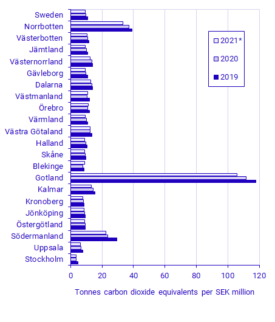

# Challenge 1: Regional Emission Intensity Analysis

:::{objectives}
You have access to the Statistics Sweden (SCB) data through the MCP server. You can query environmental and economic data using the scb_* tools. The goal is to analyze and compare emission intensity across Swedish regions.
:::

## Use case

::::::{exercise} Challenge
Calculate and compare the gross emission intensity (tonnes of CO2 equivalents per million SEK of economic output) for at least 3 Swedish regions (e.g., Stockholm, Gotland, Norrbotten) for the years 2019-2021.
:::::::

:::{important}

**Example workflow**
- Start by searching for tables showing emission data and econonic profile by region.
- Compute emission intensity using the formula: `Intensity = Emissions (tonnes) / GRDP (million SEK) * 1000` for the years 2019-2021.

**Ground truth**: [SCB report: Regional greenhouse gas emissions are increasing](https://www.scb.se/en/finding-statistics/statistics-by-subject-area/environment/environmental-accounts-and-sustainable-development/system-of-environmental-and-economic-accounts/pong/statistical-news/environmental-accounts--emissions-to-air-regional-statistics-2021/)

:::

The required tables can be easily retrieved using the search function in the MCP server. However just in case if you get stuck,
here is a hint:

:::{hint}
:class: dropdown

The following tables to use
1. Emissions data: Retrieve air emissions by region and substance (GHG in tonnes CO2 equivalents) from table TAB4357
2. Economic data: Retrieve Gross Regional Domestic Product (GRDP) by region from table TAB3138
:::

## Futher improvements

:::::::{exercise} Optional Challenges
1. **Interactive Visualization**: Create an interactive plot showing emission intensity trends over time for multiple regions.

:::{tip}
- Instruct which library to use:
  - Generate a Python app which uses libraries like Plotly, Matplotlib, Gradio, Streamlit etc.
  - Use Javascript (either front-end only or full-stack) app which uses D3.js, Chart.js
:::

2. **Extended Analysis**: Extend the analysis to include more years (e.g., 2015-2023) or more regions to identify longer-term trends and regional patterns.
3. **Map Visualization**: Create a map visualization to show the distribution of emissions across different regions.

:::{tip}
- Instruct which library to use:
  - Generate a Python library like ipyleaflet or Folium
  - Generate Javascript app which uses leaflet.js
:::

:::::::
