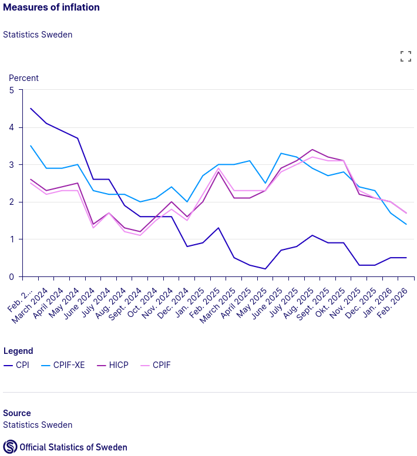

# Challenge 2: Inflation Measures Analysis

:::{objectives}
You have access to the
- Statistics Sweden (SCB) data through the `scb-opendata-mcp` server. You can query economic data using the scb_* tools.
- Rikskbanken data through the `swemo-mcp` for CPI, CPIF, GDP, and other economic indicators.

The goal is to analyze and compare different inflation measures in Sweden.
:::

## Use case

::::::{exercise} Challenge
Retrieve and compare the following inflation measures for Sweden for the years 2020-2025:
- CPI (Consumer Price Index)
- CPIF (Consumer Price Index with fixed interest rate)
- CPIF-XE (CPIF excluding energy products)
- HICP (Harmonized Index of Consumer Prices)

Calculate the annual inflation rate for each measure and visualize the trends.
:::::::

:::{important}

**Example workflow**
- Start by searching for tables showing the different inflation measures.
- Retrieve the monthly or annual data for the specified measures. Aggregate them if needed.

**Ground truth**: [SCB report: Different measures of inflation](https://www.scb.se/en/finding-statistics/statistics-by-subject-area/prices-and-economic-trends/price-statistics/consumer-price-index-cpi/pong/statistical-news/consumer-price-index-cpi-february-2026/)
  

:::

## Further improvements

:::::::{exercise} Optional Challenges
1. **Interactive Visualization**: Create an interactive plot showing the trends of different inflation measures over time.

:::{tip}
- Instruct which library to use:
  - Generate a Python app which uses libraries like Plotly, Matplotlib, Gradio, Streamlit etc.
  - Use Javascript (either front-end only or full-stack) app which uses D3.js, Chart.js
:::

2. **Extended Analysis**: Extend the analysis to include more years (e.g., 2010-2025) to identify longer-term trends.
3. **Correlation Analysis**: Analyze the correlation between different inflation measures and the GDP (Gross Domestic Product).

:::{tip}
- Instruct which library to use:
  - Generate a Python app which uses libraries like Pandas, NumPy, Scipy, Seaborn etc.
:::

:::::::
