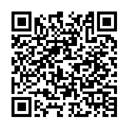

# Wrap up

We start at ~~20:00:~~ **19:55 (NEW TIME!)** with the wrap up and demos.

:::{objectives}
- Each team presents for **5 minutes** sharing their hack.
:::

:::{questions}
Some suggested questions to present:

- Did you find something interesting or unexpected from the data through your hacks?
- Are there any thoughts on your experience with this workflow?
:::

# Feedback

Scan the QR code above **or** answer below in our feedback survey. Your input is valuable, so please take your time to add your comments.

<iframe src="https://nextcloud.naiss.se/apps/forms/embed/yTbF8DbbFNM7sCCXCgMTSGNp" width="100%" height="900">
</iframe>

Link to the form: <https://nextcloud.naiss.se/apps/forms/embed/yTbF8DbbFNM7sCCXCgMTSGNp>
