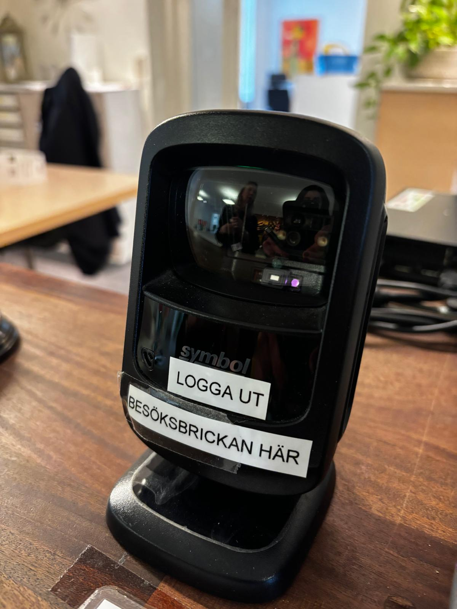

# 25 March 2026: Agentic AI with Swedish public data

:::{prereq}

- You are registered with the event
- You have dabbled with AI agents or are curious about it

:::

The task will be to create "research agents" using Mimer and open weight models that can answer questions using Sweden's public data (from SCB and Riksbanken).
You are of course free to use your favourite coding agent/IDE of choice.

## Schedule

```{csv-table}
:delim: ;
:widths: auto

17:15; Doors open + mingle
18:00; Introduction to Mimer and the hackathon task. The task will be to create "research agents" using Mimer and open weight models that can answer questions using Sweden's public data (e.g. SCB).
18:30; Hackathon begins
19:55; Wrap-up presentations and demos
~~20:00~~; ~~Wrap-up presentations and demos~~
20:30; Home time

```

:::{important}
{width=300px align=right}

Before leaving the RISE offices, please remember to **scan your badge** in the device shown here.

You can then return the orange tag at the reception.
:::

## Instructions


```{toctree}
:maxdepth: 2

setup
setup-fallback
intro
challenge-1
challenge-2
challenge-3
epilogue
```
