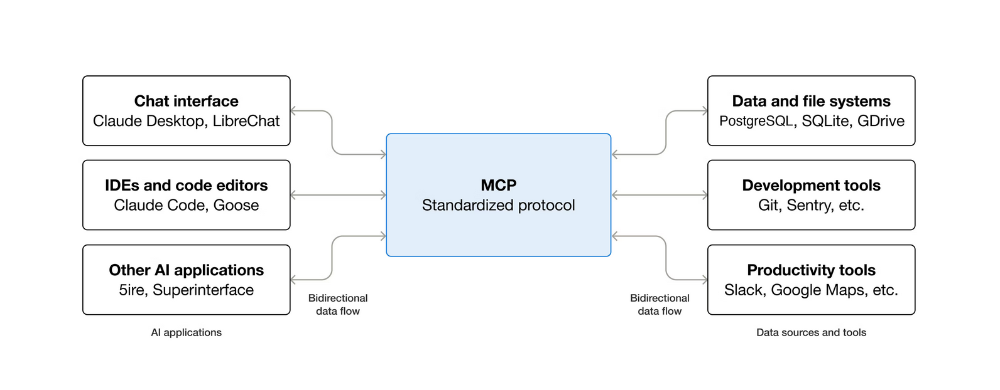
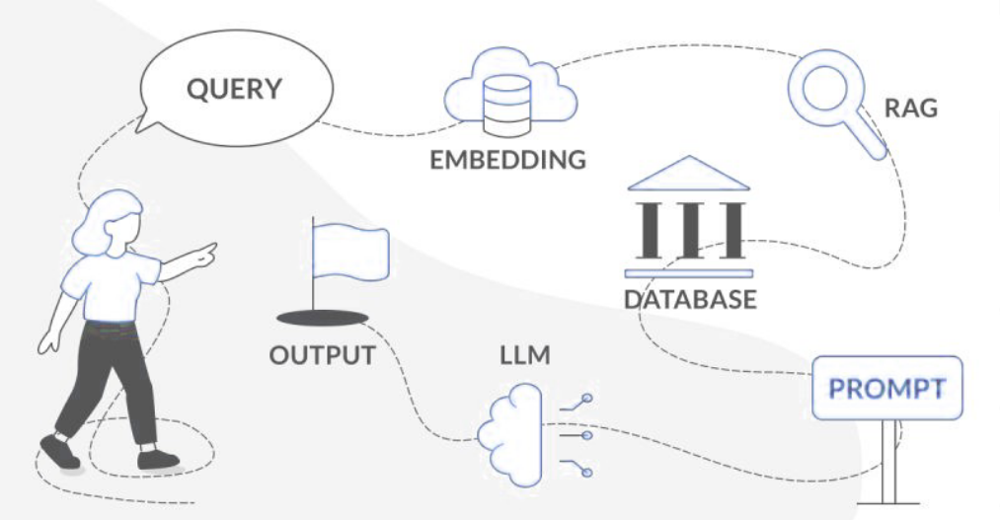
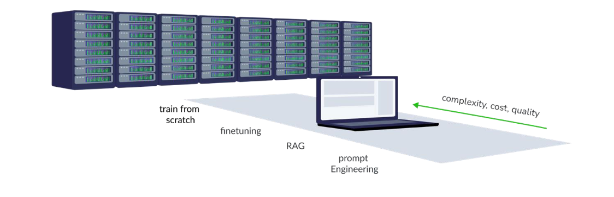

# Introduction

:::{questions}
- What are LLMs and how do they work?
- What is agentic AI and how does it differ from traditional AI?
- How do you manage context and use MCPs in agentic systems?
- What are the differences between RAG and fine-tuning?
:::

## Large Language Models (LLMs)

Large Language Models (LLMs) are AI systems trained on vast amounts of text data to understand and generate human-like language. They excel at tasks like text completion, translation, summarization, and question-answering. LLMs leverage deep learning techniques, particularly transformer architectures, to process and generate coherent and contextually relevant text.

In this hackathon, we will be focusing on the question-answering, code generation and tool-calling capabilities of LLMs.

## Agentic AI

Agentic AI refers to systems that can autonomously perform tasks, make decisions, and interact with their environment to achieve specific goals.

One way of designing an "agentic workflow" would be to repurpose coding agent harnesses. Coding agents are conversational AI models with access to tools such as reading/writing files, web search, and invoking shell commands. They live either in the IDE or in standalone command-line or GUI tools. This means they can be made highly autonomous through tool-calling or MCPs, enabling a wide variety of use cases.

:::{seealso}
- [Wait, what is agentic AI? - Stack Overflow](https://stackoverflow.blog/2025/04/17/wait-what-is-agentic-ai/)
- [Agentic AI Foundation (AAIF)](https://aaif.io/), a Linux Foundation project
:::

## Context and domain knowledge

Managing context is one way to add domain knowledge. It involves adding relevant information to ensure coherent and meaningful interactions. 

### MCP

MCPs (Model Context Protocol) is an open-source standard for connecting AI applications to external systems. It enables AI applications to access data sources, tools, and workflows, enhancing their capabilities and allowing them to perform tasks more effectively. It can be though of as a **opinionated REST API** for AI applications.

> Schematic of an MCP server. Source: [What is the Model Context Protocol (MCP)? - Model Context Protocol](https://modelcontextprotocol.io/docs/getting-started/intro)

Today, we will only use MCP servers as *read-only* or *query* tools to replace the need for a RAG system. However it are much more uses of [MCP primitives](https://modelcontextprotocol.io/docs/learn/architecture#primitives) with which one can prepare reusable and few shot prompts templates and do so [much](https://modelcontextprotocol.io/extensions/apps/overview) [more](https://modelcontextprotocol.io/extensions/auth/overview). 

:::{seealso}
[Official MCP Registry](https://registry.modelcontextprotocol.io/)
:::

#### Other approaches with RAG and Fine-Tuning

> Schematic of RAG. Source: [LLMs on Supercomputers, AI Factory Austria](https://gitlab.tuwien.ac.at/vsc-public/training/LLMs-on-supercomputers/)

Retrieval-Augmented Generation (RAG) combines the strengths of retrieval-based and generative models, allowing systems to fetch relevant information from a knowledge base and generate responses based on that data. A RAG system can be thought of as an LLM model interacting with a **fuzzy search engine** in the "embedding space". 

In comparison, MCP offers an alternative approach to RAG to carefully pass the context to the LLM, adding ability to add guardrails and validations.

> How can you influence the output of LLMs?

Fine-tuning, on the other hand, involves training a pre-trained model on a specific dataset to adapt it to a particular task or domain. While RAG is flexible and can handle dynamic information, fine-tuning provides more specialized and optimized performance for specific tasks. Based on your needs, the choice between RAG / MCP and fine-tuning depends on the nature of your data, the specific requirements of your application and the compute available.

### Skills

Skills are a lightweight, open format for extending AI agent capabilities with specialized knowledge and workflows. They allow agents to load procedural knowledge and context on demand, enabling them to perform tasks more accurately and efficiently. Skills are defined in a `SKILL.md` file and can include instructions, scripts, and resources.

:::{seealso}
- [What are skills? - Agent Skills](https://agentskills.io/what-are-skills)
- [Simon Willison's blog on skills](https://simonwillison.net/tags/skills/)
:::

### Context management

If there is one thing you should remember, it would be to **take care of your context window**.

A drawback of RAG and MCP is that you need a context window upwards of 32k tokens. This is due to the additional overhead of system prompts and tool descriptionthat is hidden in plain sight. During the hackathon these commands within OpenCode (or equivalent) will turn out to be useful:

- `/clear` - **Clears the context window**. The most basic control, coding agents support clearing the context window (starting a new conversation), which you should do for unrelated queries.
- `/compact` - **Compaction**. To enable conversations of unbounded length, coding agents support context compaction: if the conversation history grows too long, they will automatically call an LLM to summarize the prefix of the conversation, and replace the conversation history with the summary. Some agents give control to the user to invoke compaction when desired.

## Summary

This hackathon aims to inspire you on how to use agentic AI for your own internal data and get reasonably correct answers. We showcase the capabilities of:
- open-weight LLM models
- MCP
- Skills

to demonstrate the potential of sovereign AI. If you learned something new, that's a bonus! Our goal is to empower you with the knowledge and tools to leverage agentic AI effectively.

:::{keypoints}
- Your data, your rules: Use agentic AI to harness your internal data.
- Sovereign AI: Explore the potential of open-weight LLM models.
- Spreading the word: Expand your skills and knowledge in AI.
:::
